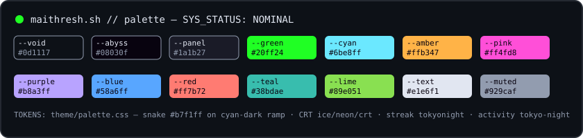

# maithresh.sh // contributions

`SYS_STATUS: NOMINAL` // `LOC: HYDERABAD` // `USER: Optional-BhanuPrakash` // `THEME: TERMINAL-HUD-DARK`

> `$ cat contributions.md` — every visual below is generated from live contribution data, dark-only, single file. No inflated claims: if a panel 404s, it says so inline.

**TELEMETRY // SOURCES** — `maithresh.sh` companion repo. Blends with the terminal-HUD language: `$ prompts`, `STAGE //` pipelines, phosphor glow. Auto-updated daily via GitHub Actions.

`$ load theme/palette.css` // every animation below is wired to these tokens:

- snake → `--pink` serpent `#ff4fd8` on `--panel→--cyan→--green` dot ramp (`games.yml`)
- CRT → presets are the palette sources (`crt`=`--green`, `amber`, `ice`≈`--cyan`, `neon`=`--pink`+`--cyan`)
- maeul → `motion: full` locked (`maeul.yml`)
- metrics → `terminal` template · streak `tokyonight` · activity `tokyo-night`
- site → same file: `theme/palette.css` (`var(--void)` … `var(--teal)`)

---

`$ run crt --primary` // PRIMARY — terminal-HUD match

## STAGE 01 // SIGNAL-BOARD — CRT dashboard

`stefashkaa/github-profile-crt` → `assets/` on `main` · animated scanlines · phosphor glow · `crt.yml` · verified live `2026-09-26`

`$ echo $STATUS` — if the SVGs above 404, run **Actions → Build CRT contribution SVGs → Run workflow** once.

---

`$ run village --seeded-terrain`

## STAGE 02 // TERRAIN — Maeul isometric village

`t1seo/maeul-in-the-sky` → `maeul-in-the-sky-dark.svg` + snapshot on `main` · `maeul.yml` · quiet days form water, active days grow forest → farm → village → city

 
<a href="https://t1seo.github.io/maeul-in-the-sky/tour/?snapshot=https%3A%2F%2Fraw.githubusercontent.com%2FOptional-BhanuPrakash%2Fboku_contributions%2Fmain%2Fmaeul-in-the-sky.snapshot.json">OPEN 3D TOUR ↗</a>

---

`$ run snake --pathfinding`

## STAGE 03 // SERPENT — contribution snake

`Platane/snk` → `output` branch via `games.yml` · eats the grid in path order

---

`$ run arcade --all-6`

## STAGE 04 // ARCADE — 6 playable classics

`abozanona/pacman-contribution-graph` → `output` branch via `games.yml` · busiest days = power pellets · ghosts chase with real behaviors

---

`$ run city --isocalendar`

## STAGE 05 // CITY — 3D calendar + terminal metrics

`lowlighter/metrics` template **`terminal`** → root on `main` · `metrics.yml` · isocalendar + base

Live 3D badge — link only, no embed (`/api` returned `404` on `2026-09-26`, so no broken image here):

- [Open CommitPulse 3D city ↗](https://commitpulse.vercel.app/?username=Optional-BhanuPrakash)

---

`$ curl -s stack.local/streak`

## STAGE 06 // UPTIME — streak + activity

Streak card — verified live `2026-09-26` (`tokyonight`, animated):

Activity graph — `DEGRADED 2026-09-26`: host returns `402` on all themes, embed kept for auto-recovery, metrics activity panel above is the fallback:

---

`$ git log --oneline -5` // OPERATOR NOTES

- Workflows: `crt.yml` · `maeul.yml` · `metrics.yml` · `games.yml` (arcade + snake merged — single `output` push, fixes the old two-workflow clobber). Deleted: `arcade.yml`, `snake.yml`.
- First run: **Actions → run each workflow once** (`crt` already green). `output` branch appears after `games` goes green.
- Fixes shipped: streak URL slash + `tokyonight` theme · metrics `classic` → `terminal` · CommitPulse demoted to link (`/api` 404) · activity-graph marked degraded (`402`).
- Copy any `STAGE` block into `Optional-BhanuPrakash/Optional-BhanuPrakash` profile README — paths for `output` are absolute, `main` assets are relative.

---

`maithresh.sh // contributions` · `LOC: HYDERABAD` · designed & engineered solo · `© 2026`
